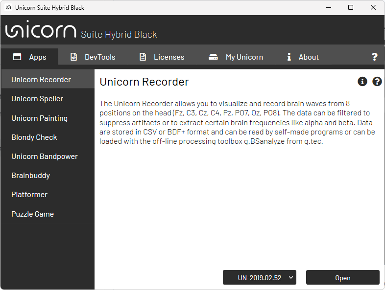
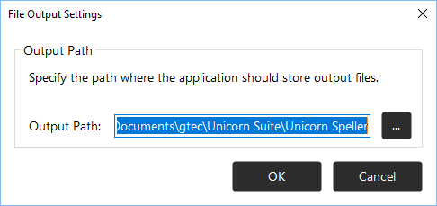
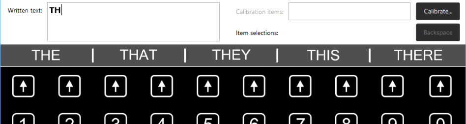
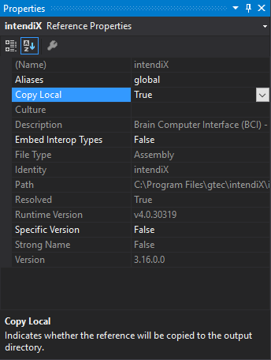

# Unicorn Speller Hybrid Black
Unicorn Speller is a spelling system that uses the P300 complex. Numerous items such as letters flash the screen. The user must silently count each time the item he/she wants to select flashes, and ignore all other flashes.  

[Requirements for test-to-speech output](#Requirements-for-test-to-speech-output)<br/>
[Files on your computer](#Files-on-your-computer)<br/>
[Terms](#Terms)<br/>
[Mounting Unicorn Hybrid EEG Electrodes](#Mounting-Unicorn-Hybrid-EEG-Electrodes)<br/>
[Starting Unicorn Speller](#Starting-Unicorn-Speller)<br/>
&nbsp;&nbsp;&nbsp;[Starting Unicorn Speller from the Unicorn Suite](#Starting-Unicorn-Speller-from-the-Unicorn-Suite)<br/>
&nbsp;&nbsp;&nbsp;[Starting Unicorn Speller via command line](#Starting-Unicorn-Speller-via-command-line)<br/>
&nbsp;&nbsp;&nbsp;[StructurBehavior of Unicorn Speller on startup](#Behavior-of-Unicorn-Speller-on-startup)<br/>
[Unicorn Speller](#Unicorn-Speller)<br/>

## Requirements for test-to-speech output
Unicorn Speller uses the text-to-speech engines and voices that are supported by the operating system for text-to-speech output. A voice must be displayed and working in the **Text to Speech** link of the control panel’s **Speech Recognition** configuration page before it can be used with Unicorn Speller. When obtaining voices of different styles and languages from third-party vendors, ensure that these voices are compatible with the current version of your operating system.

<p align="center">
<br/>
</p>

Select Speech Recognition from the operating system's control panel and click the Text to Speech item on the left to open the Speech Properties window. A voice must be listed under 'Voice selection' before it can be used with Unicorn Speller. 


| <div style="width:50px"></div>| **Attention:** <br/> A voice that is not compatible with the currently used operating system version will not work and can cause the program to crash or work improperly!|
|-|-|

## Files on your computer
**Unicorn Speller files** – are stored under (assuming that the default path setting is used):
```
C:\Program Files\gtec\Unicorn Suite\Hybrid Black\Unicorn Speller
```

Unicorn Speller user directory – is created under:
```
C:\Users\<username>\Documents\gtec\Unicorn Suite\Hybrid Black\Unicorn Speller
```

**Predefined board configurations** – are created on each start of the program in the following subfolder of the Unicorn Speller user directory:
```
C:\Users\<username>\Documents\gtec\Unicorn Suite\Hybrid Black\Unicorn Speller\Boards
```
**Calibration files** – will be stored on calibration in the following subfolder of the Unicorn Speller user directory (if no explicit path is specified on calibration):
```
C:\Users\<username>\Documents\gtec\Unicorn Suite\Hybrid Black\Unicorn Speller\Classifiers
```
**Word prediction dictionaries** – are installed into the following subfolder of the Unicorn Speller user directory:
```
C:\Users\<username>\Documents\gtec\Unicorn Suite\Hybrid Black\Unicorn Speller\Dictionaries
```

## Terms
The table below lists the terms used throughout the document along with a short description:
|Term|Description|
|-----|-----|
|Dark time|The duration where no item flashes directly after a previous item has flashed.|
|Flash time|The duration the item(s) flash when they’re flashed on.|
|Flashing|The actual mode of operation of Unicorn Speller, where the items on the board are flashing and Unicorn Speller tries to select the item that the user is silently counting based on the user’s EEG signals.|
|Calibration item|The item that the user wants to select. This item should be selected by Unicorn Speller after some flash cycles. For calibration, calibration items must be predefined in the calibration items panel to provide Unicorn Speller information if the measured EEG currently belongs to a calibration or a non-calibration item. Based upon this information, Unicorn Speller learns to separate signals belonging to calibration items from signals belonging to non-calibration items.|
|Non-calibration item|Each item in the board that is currently not a calibration item.|
|Randomized patterns mode|During flashing, a randomized selection of items (a.k.a. pattern) distributed across the whole board flash at the same time. The patterns flash consecutively. One single flash cycle is complete when each item on the board has flashed exactly once.|
|Row/column mode|During flashing, all items in a whole row or column flash at the same time. The rows and columns flash consecutively. One single flash cycle is complete when each item on the board has flashed exactly once.|
|Single character mode|During flashing, only one item on the board flash at any time. Each item flashes consecutively. One single flash cycle is complete when each single item of the board has flashed exactly once.|
|Flash cycle|A group of flashes such that each item of the board has flashed exactly once.|
|Free-spelling mode|Unicorn Speller is calibrated and selects items based on the user’s EEG signals during flashing.|
|Copy-spelling mode|Before the flashing begins, the user can specify the desired items he or she is going to focus consecutively during the following flashing session by adding them to the calibration items panel. Specifying calibration items has no influence on the mode of operation during flashing. Unicorn Speller behaves just as in the free-spelling mode. The calibration items serve just as an orientation aid for the user. This mode is used to verify a successful calibration.|
|Calibration|To calibrate Unicorn Speller, the user has to preselect several calibration items he or she is going to focus consecutively during the following flashing cycles by adding them to the calibration items panel. After the flashing ends, Unicorn Speller learns to separate the EEG signals of the EEG segments that belonged to calibration items from those that belonged to the non-calibration items.|

## Mounting Unicorn Hybrid EEG Electrodes
Unicorn Speller works with real-time EEG data measured and transmitted by the Unicorn Brain Interface. Unicorn Speller is intended to be used with eight EEG channels using unipolar derivation. The table below lists the electrode assignment.

<p align="center">

|Electrode position|Color|Description|
|-----|-----|-----|
|Left mastoid|Yellow|L|
|Right mastoid|Blue|R|
|Fz|Red|Channel 1|
|C3|Red|Channel 2|
|Cz|Red|Channel 3|
|C4|Red|Channel 4|
|Pz|Red|Channel 5|
|PO7|Red|Channel 6|
|Oz|Red|Channel 7|
|PO8|Red|Channel 8|

</p>

## Starting Unicorn Speller
After finishing the installation, Unicorn Speller can be started with the Unicorn Brain Interface. In order to use Unicorn Speller, several Unicorn Hybrid EEG Electrodes (see section [Mounting Unicorn Hybrid EEG electrodes](#mounting-unicorn-hybrid-eeg-electrodes)) must be attached the user’s head and connected to the Unicorn Brain Interface.

### Starting Unicorn Speller from the Unicorn Suite
The Unicorn Speller can be started from the Unicorn Suite. The Unicorn Speller is listed in the Unicorn Suite in the ‘’Apps’’ section. Before being able to start Unicorn Speller, the application must be unlocked using the license manager. The Unicorn Brain Interface must be paired before using it with the Unicorn Speller. If the Unicorn Brain Interface is paired, the serial number of the Unicorn Brain Interface should be listed in the drop-down box in the Unicorn Suite. Select the serial number and press open, start the Unicorn Speller with the selected Unicorn Brain Interface.

<p align="center">
<br/>
</p>

This dialog is displayed if the connection attempt failed. Make sure that the Unicorn Brain Interface is turned on and paired before using the Unicorn Recorder.

### Starting Unicorn Speller via command line
Change your directory in the command line window to the folder where Unicorn Speller has been installed. You can start Unicorn Speller now by using the following command line form:
```
intendiX.exe [-device <deviceType>] [-deviceSerial <deviceSerialNumber>] [-ch <numChannels>] [-board <filename>] [-record <filename>] [-testmode]
```
The table below lists a description of the supported command line options:

|Option|Description|
|------|-----------|
|-device ```<deviceType>```|Specifies the type of Unicorn Brain Interface that is used with the application. Supported values for ```<deviceType>``` are Unicorn. The default value is Unicorn.|
|-deviceSerial ```<deviceSerialNumber>```|The serial number of the Unicorn Brain Interface that is used as default. If not specified, the most recently used device is used.|
|-ch ```<numChannels>```|Specifies the number of channels that shall be used. Valid values range from 1 to 8 for Unicorn Brain Interfaces. If the specified number of channels is less than available number channels, the application uses only the channels from 1 to ```<numChannels>```. <br>Attention: A previous calibration performed with a different number of channels will not work.|
|-board ```<filename>```|The filename of the board to load as default. If not specified, the most recently loaded board is used. <br>If a relative path or only the filename is specified, the path is relative to the default predefined board configurations directory (see section [Files on your computer](#files-on-your-computer)).|
|-record ```<filename>```|All EEG data received from the Unicorn Brain Interface will be written to an ASCII text file specified by ```<filename>```. The application writes permanently to the file as long as the application is running. Reading from the file is permitted from other programs while the application is running and writing to the specified file. <br>If a relative path or only the filename is specified, the path is relative to the default Unicorn Speller user directory (see section [Files on your computer](#files-on-your-computer)).|
|-testmode|If specified, the Unicorn Brain Interface sends a test signal to the PC, ignoring the input signals of the connected Unicorn Hybrid EEG Electrodes. This mode is for testing connection and proper working of the Unicorn Brain Interface only! Using this test mode causes Unicorn Speller to work improperly because it never receives real EEG signals in this mode!|

#### File format of the recorded samples using the -record option
When starting Unicorn Speller via command line with the ```–record``` option specified, the created ASCII text file is built up in the following way, each line representing one sample (assuming the used number of channels is ```c``` and there are n columns in the whole file separated by the tabulator):
|Column (separated by tabulator)|Content|
|-----|-----|
|```1```|Measuring time of the sample in seconds|
|```2…n-2```|Sample values of channels 1 to ```ch``` in microvolt (```µV```), each column representing one channel|
|```n-1```|The one-based indices of all items that were flashing while this sample has been measured, separated by commas. A value of zero indicates that no items were flashing at the time of measuring this sample. The index of the top-left item of the board is 1, index of an item in the column ```col``` (1-based) and the row ```row``` (1-based) will be calculated as: ```index = (row-1) * <number of columns> + col.```|
|```n```|A value of 0 or 1 indicates that the flashing item or row/column with index specified in column n-1 at sample time was a calibration item/row/column (1) or not (0). If no information about calibration items is available, a 0 is written as well.|

On closing the application, a header will be inserted in the first few rows of the file to make the file compatible with g.BSanalyze, a toolbox from g.tec medical engineering GmbH created for MATLAB and SIMULINK. Details on this header can be found in the user manual of g.BSanalyze.

### Behavior of Unicorn Speller on startup
The predefined boards with filename ```StandardBoard.ibc```, and ```SimpleBoard.ibc``` and ```EmptyBoard.ibc``` will be restored at each startup of Unicorn Speller in the default directory for predefined board configurations (see section [Files on your computer](#files-on-your-computer)). Therefore, changes made to these files are not persistent.

On startup, Unicorn Speller connects the most recently used Unicorn Brain Interface with the most recently used settings and the main window is shown. If Unicorn Speller can load the most recent calibration, it immediately starts the free-spelling mode with the last used configuration. Otherwise, the user must manually prepare and start spelling.

## Unicorn Speller
When starting Unicorn Speller, the main window of the application is shown.
<p align="center">
<br/>
</p>

The main window consists of 5 main elements:
1. The **status bar** at the top on the right of the main window indicates the current state of the application.
2. The **menu bar** below the status bar lets you access all components of the application.
3.	The **Written text** box displays the corresponding **Output Text** of a selected item. Right click on that area to open a context menu where size and style of the font of the written text can be changed.
    - The **Calibration items** panel displays the selected calibration items during calibration or in copy-spelling mode. When no calibration items are selected, this panel is grayed out. With the **Backspace** button, items can be removed from the calibration items panel.
    - The **Item selections** panel displays previously selected items. In copy-spelling mode, all selected items are displayed. In free-spelling mode, only the last three selected items are displayed.
4. The **completion suggestions** panel (between the **Written text** box and the **board** area) displays probable word completion suggestions based on the currently written text. A completion suggestion can be selected and inserted into the **Written text** by selection of one of the corresponding up-arrow items right below in the first row of the board.
    - The **completion suggestions** panel is not shown if word prediction is disabled. In this case, selection of an up-arrow item would have no effect. See sections [Word Prediction](#word-prediction) and [Configuring item: Select completion suggestion](#configuring-item-select-completion-suggestion) for details on word prediction.
5.	The **board** area in the middle of the main window displays the set of possible selectable items. Double-clicking on an item in standby mode will add it to the calibration items panel.

| <div style="width:50px"></div>| **Note:** <br/> You can resize the main window according to your preferences and needs.|
|-|-|

| <div style="width:50px"></div>| **Note:** <br/> All user specific settings (such as connection, timing,…) and used files (such as calibration file, board configuration file,…) of the application will be stored to a default configuration file when Unicorn Speller is closed. This default configuration is used next time you start Unicorn Speller.|
|-|-|


### Status Indicators
The status bar contains four status indicators:

<table>
    <thead>
        <tr>
            <th>Status indicator</th>
            <th>Possible states</th>
            <th>Description</th>
        </tr>
    </thead>
    <tbody>
        <tr>
            <td rowspan="4">Connection</td>
            <td>Data acquisition running</td>
            <td>The application is connected to the Unicorn Brain Interface and receives EEG data.</td>
        </tr>
        <tr>
            <td>Data acquisition stopped</td>
            <td>The application can’t receive data from a Unicorn Brain Interface. Please ensure that the Unicorn Brain Interface is turned on and on standby, then check connection settings in menu <strong>→ Connection...</strong></td>
        </tr>
        <tr>
            <td>Connecting to device...</td>
            <td>The application tries to establish a connection to the selected Unicorn Brain Interface. To change the Unicorn Brain Interface, go to menu <strong>→ Connection…</strong></td>
        </tr>
        <tr>
            <td>Not connected</td>
            <td>The application is not connected to a Unicorn Brain Interface and can’t receive data. Please ensure that the Unicorn Brain Interface is turned on and on standby, then check connection settings in menu <strong>→ Connection…</strong></td>
        </tr>
        <tr>
            <td rowspan="2">Signal quality</td>
            <td>Good signal quality</td>
            <td>The specified signal quality criteria are met. Here the signal quality is rated to be good.</td>
        </tr>
        <tr>
            <td>Poor signal quality</td>
            <td>The specified signal quality criteria are not met for at least one channel (the name of the first channel that doesn’t meet the criteria is displayed directly below, and the name of all channels that do not meet the criteria is displayed when the mouse hovers over). Signal quality is said to be poor. You can inspect the signals in the data viewer ().</td>
        </tr>
        <tr>
            <td rowspan="2">Calibration state</td>
            <td>Calibrated</td>
            <td>The last used calibration could be loaded and is ready to operate. <br/><br/> <strong>ATTENTION:</strong><br/> A calibration file that could be loaded but wasn’t created with the currently used number of channels will not work even if the status indicator says it is okay.</td>
        </tr>
        <tr>
            <td>Not calibrated</td>
            <td>Unicorn Speller must be calibrated, or an existing calibration file must be selected (menu <strong>→ Selection method…</strong>)</td>
        </tr>
        <tr>
            <td rowspan="3">Network output state</td>
            <td>Network output enabled</td>
            <td>Network output is enabled and no error occurred on sending the most recently selected item over the network.</td>
        </tr>
        <tr>
            <td>Couldn't send item over network</td>
            <td>If network output is enabled (menu <strong>→ Network output…</strong>) and an item couldn’t be sent on selection, this status message will be presented. Please ensure that your firewall allows outgoing connections for Unicorn Speller on the specified port.</td>
        </tr>
        <tr>
            <td>Network output disabled</td>
            <td>Network output is disabled.</td>
        </tr>
    </tbody>
</table>


## Establish a connection to the Unicorn Brain Interface
### Connection via Bluetooth
Before you can establish a Bluetooth connection between your Unicorn and your PC for the first time, you first have to pair your Unicorn with your PC. Unicorn Speller can connect to the Unicorn once it is paired with the PC, turned on and in standby mode.

Open the **Data Acquisition Configuration** dialog to configure the settings of the connection by selecting ** →  Connection…** from the menu bar as illustrated.
<p align="center">
<br/>
</p>

Select **→ Connection**… from the menu to edit connection settings of Unicorn Speller.

The **Data Acquisition Configuration** dialog will open as shown below.
<p align="center">
<br/>
</p>

If your Unicorn Brain Interface is not listed in the drop-down menu but it is connected to your PC, click the **Find connected devices** button. Unicorn Speller now searches for paired Unicorn Brain Interfaces and lists the serial numbers of the found devices in the drop-down list afterwards. While the application tries to establish a connection to the first found Unicorn Brain Interface, the **Connection State** indicator changes its state to Connecting…. This may take several seconds.

| <div style="width:50px"></div>| **Attention:** <br/> If the **Data Acquisition Configuration** dialog states that an unrecommended Bluetooth adapter or no Bluetooth adapter is detected, please connect the recommended Bluetooth adapter that was shipped together with your Unicorn and disconnect all other Bluetooth adapters. Also, disable a possibly built-in Bluetooth adapter. Otherwise, the Unicorn might not work properly. Search again for connected Unicorns when the recommended Bluetooth adapter is connected.|
|-|-|

You can select a different Unicorn Brain Interface by selecting the desired serial number from the drop-down list. When a connection could be established, the **Connection State** indicator changes its state to Device found and reads the configuration of the Unicorn Brain Interface (see **Error! Reference source not found**.).

<p align="center">
<br/>
</p>

| <div style="width:50px"></div>| **Note:** <br/> The dialog displays the filter settings of the hardware (i.e. the Unicorn Brain Interface) only. Unicorn Speller additionally uses software filters for signal processing, but their settings are not displayed in the **Data Acquisition Configuration** dialog.|
|-|-|

| <div style="width:50px"></div>| **Note:** <br/> When a serial number is selected in the drop-down list but the **Connection State** keeps indicating that the Unicorn Brain Interface is not found, ensure that the Unicorn Brain Interface is turned on and paired.|
|-|-|

Click **OK** to establish a connection with the selected Unicorn, configure it with the chosen options and start data acquisition.

### Loss of Connection
When Unicorn Speller is currently not connected to an Unicorn Brain Interface or has lost its Bluetooth connection, it periodically tries to reconnect to the Unicorn Brain Interface every few seconds.

### No connection between Unicorn Speller and Unicorn Brain Interface
In certain cases, Unicorn Speller either can’t establish a connection with the Unicorn Brain Interface or an existing connection gets lost. This could result if the battery is too low, the Unicorn Brain Interface is turned 
off or a subject leaves the Bluetooth transmission range.

When Unicorn Speller is not able to reconnect to the Unicorn Brain Interface, please turn off the Unicorn Brain Interface and turn it on again afterwards. The Unicorn Brain Interface will return to standby mode and 
Unicorn Speller can reconnect to the Unicorn Brain Interface.

## Check Signal Quality
Before you start working with Unicorn Speller, you should ensure that the incoming signals are high quality, so that Unicorn Speller will operate under optimal conditions. You can either investigate the incoming signals using the built-in data viewer or you can obtain information about the signal quality of each channel by defining threshold values of the integrated quality criteria. Both options are described in this section.

### THe Data Viewer
Open the Data Viewer by selecting  from the menu bar. The data viewer will open.

<p align="center">
<br/>
</p>
Select  from the menu bar to open the data viewer window.

<p align="center">
<br/>
</p>

The data viewer shows the signal of each channel in a regular scaling range between ```-50 µV``` and ```+50 µV``` (µV = ```microvolts```) in a separate color for a period of ```10``` seconds. Data are overwritten from left to right. If signal amplitudes exceed the scaling range, the signals will overlap the area of channels below or above. The signals will only be truncated at the top and the bottom of the whole drawing area, respectively. Corresponding channel numbers and signals are plotted in the same color.

| <div style="width:50px"></div>| **Note:** <br/> Spontaneous EEG signal amplitudes are typically within the range of ```±50 µV``` (using monopolar derivation techniques). If the signals are much smaller or much bigger, please check your electrode settings.|
|-|-|


You can quickly check the signal quality by advising the user to perform some simple activities listed in the following steps:
1. The quiescent EEG of a person who is not moving should look like in the following pictures. As you can see, all channels look quite similar and range within ±50 µV.

<p align="center">
<br/>
</p>

2. Advise the user to blink several times and watch the corresponding EEG signal. For each eye blink, the EEG signal should show a clear deflection, as shown in the picture above.

<p align="center">
<br/>
</p>

3.	Advise the user to close his or her eyes and relax for several seconds. The EEG signal should show a rhythmic oscillation **Error! Reference source not found**. reflecting increased alpha activity.
<p align="center">
<br/>
</p>

4.	Advise the user to clench his or her teeth for a short time. This should temporarily cause strong artifact in the EEG signals, as shown in the picture above.

When you get similar results for those tests, the signal quality should be good.

After finishing inspection, close the **Data Viewer** dialog. The dialog will also be closed when clicking somewhere outside of the dialog.

### Integrated Signal Quality Criteria
For each channel, the actual built-in signal quality criteria are evaluated separately and result in an estimation of the signal quality (good or poor). Only the two most recent seconds of the signal will be considered for evaluation. If both criteria indicate good signal quality, the whole channel will show good signal quality. Otherwise, the channel shows poor signal quality.

There are two built-in signal quality criteria that will be checked: the bandpower mean difference (BPMD) and the standard deviation (SD).
-  **The standard deviation criterion**: 
    - If the standard deviation of the 2 last seconds of the signal of the corresponding channel is within 7 µV and 50 µV, the signal quality is assumed to be ```Good```. If the standard deviation lies outside this range, the signal quality is assumed to be ```Poor```.
- **The bandpower mean difference criterion**: 
    - The signal processing chain of Unicorn Speller applies notch filters that block frequencies around 50 Hz and 60 Hz on the incoming signal from the Unicorn Brain Interface and a bandpass filter with cutoff frequencies of 0.1 Hz and 30 Hz afterwards. First, the mean signal amplitude of the 50 Hz and 60 Hz frequency component of the signal (within a band of ±2 Hz) after the notch filtering is calculated. Then the mean signal amplitude within the frequency range of 0.1 – 30 Hz after the bandpass filtering is calculated. If the difference between the calculated mean value after bandpass filtering and the calculated mean value after notch filtering (i.e. bandpass minus notch) is greater than 0.1 µV, the signal quality is said to be ```Good```. Otherwise, the signal quality is said to be ```Poor```.

    ## Calibrate Unicorn Speller
    Unicorn Speller must be calibrated before its first use. During calibration, Unicorn Speller learns the difference between the user’s typical EEG signals after a calibration item flashes and after all other (non-calibration) items flash. In particular, calibration creates a decision boundary that best separates the recorded signals for calibration items from all other non-calibration items. For a new signal (that comes after calibration), Unicorn Speller then decides whether this signal better matches the recorded signals for a calibration or a non-calibration item from the previous calibration session.

    Run through the following steps to successfully calibrate Unicorn Speller:

    | <div style="width:50px"></div>| **Note:** <br/> Read through all the steps before actually executing them.|
    |-|-|

    1.	Ensure that the Unicorn Hybrid EEG Electrodes are mounted correctly, the Unicorn Brain Interface runs, Unicorn Speller is connected to the Unicorn Brain Interface and receives data from it (status indicator must say that data acquisition is running) and the signals are of a good quality. Also ensure that Unicorn Speller is in standby mode, i.e. flashing must be stopped ().

    2. Add a sequence of items to the calibration items panel by double-clicking the desired items on the board. This is the sequence that the user must sequentially count during calibration. For a reasonable calibration, at least 4 calibration items are recommended. In the figure below, the sequence ```GTEC``` has been selected as a calibration item sequence.

<p align="center">
<br/>
</p>

3.	Adjust the settings for timing (see chapter [Overall COnfiguration of the board adn timing](#overall-configuration-of-the-board-and-timing)) to your needs. Note that these settings are strongly user-dependent, so you have to determine the best setting (where the resulting speed and accuracy deliver best results) empirically.

4.	At the beginning, recommended settings are:
    - for single character mode: **Flash Time** = 60ms, **Dark Time** = 10ms
    - for row/column mode: **Flash Time** = 75ms, **Dark Time** = 100ms
    - for randomized patterns mode: **Flash Time** = 75ms, **Dark Time** = 100ms

5.	Ensure that the user is sitting or lying completely relaxed in front of the screen. The screen should be centered in front of the user, and try to minimize glare or reflections. Recommended distances are:
    - approximately 60cm for a 21” screen
    - approximately 50cm for a 19” screen
    - approximately 30cm for a 10” screen

Click the **Calibrate** button. The **Calibration Settings** dialog opens. Select the flash mode for which Unicorn Speller should be calibrated and the number of flashes that are carried out sequentially for each calibration item in the calibration items panel. At least 30 flashes are recommended.
<p align="center">
<br/>
</p>

6.	When you are ready, click the **Start** button.

7. 
    | | **Note:** <br/> It is extremely important that the user has a completely relaxed posture while sitting or lying to obtain good signal quality, and hence good calibration. Any kind of muscle activity can cause artifacts in the EEG signal and substantially impair data quality and effective calibration.|
    |-|-|

    Now, ask the user to focus on the current calibration item and get ready to count it. The current calibration item for the following flashing session will be highlighted for the time specified in the **Wait time** field in the **Flashing Settings** dialog (see section [Specify the setting for flashing](#specify-the-settings-for-flashing)). Then the flashing starts and the previously specified number of flashes will be executed for the current calibration item.

    | | **Note:** <br/> Each time the current calibration item flashes on the board, the user silently count it to enhance the P300 complex in the brain signals. This is a common task to help users pay attention to each flash. The counting isn’t necessary. Hence, it doesn’t matter if the user loses the count or miscounts. You can even try it without counting.|
    |-|-|

    After the specified number of flashes has been completed for the current calibration item, the next calibration item will be highlighted for the **Wait time** and the procedure repeats for that calibration item.

    The procedure will be repeated until all calibration items have been completed this way.

    Calibration can be cancelled any time by clicking 
 in the menu bar. In this case, the current flash cycle will be completed and the process immediately proceeds to step 8. Please note that only the executed flashes will be considered for calibration.

8. After the last flash cycle for the last calibration item in the calibration items panel has been completed or calibration has been stopped by the user, the **Save Calibration Set** dialog will appear.

    Specify filename (and optionally a path) under which the calibration file should be saved to on the PC. The default filename includes a timestamp of when the calibration was performed. You can use the **…** button to browse through your file system. If just the filename without a path is specified, the calibration will be stored to the default calibration folder of Unicorn Speller see section [Files On Your Computer](#files-on-your-computer)

    An existing calibration that has been used until now will not be used anymore, but the calibration file will be kept if you want to use it again later see section [Specify The Settings For Item Selection](#specify-the-settings-for-item-selection).

    To cancel calibration and discard the recorded data, click the **Cancel** button. In this case, the recorded calibration data will be deleted.
    
    <p align="center"><br/></p>

    In the Save Calibration Set dialog, enter the filename (extension ```*.icl```) under which to save the calibration. The default filename includes a timestamp in the format ```yyyyMMdd_hhmmss```, where ```yyyy``` represents the 4-digit year, ``MM`` the 2-digit month, dd the 2-digit day, ``hh`` the 2-digit hours, ``mm`` the 2-digit minutes and ``ss`` the 2-digit seconds of the performed calibration.

9.	After a short calculation time, a confirmation message will be presented that Unicorn Speller has been calibrated successfully. If you get an error message instead, something went wrong during calibration (maybe the created calibration file couldn’t be saved to the specified location or an internal calculation error occurred). Please calibrate again.

10.	You can clear the calibration items panel now by removing each item with the **Backspace** button. Your calibration is now ready to be used.

## Write with Unicorn Speller
To use Unicorn Speller with an existing calibration, run through the following steps:

1. Ensure that the Unicorn Hybrid EEG Electrodes are mounted correctly, the Unicorn Brain Interface runs, Unicorn Speller is connected to the Unicorn Brain Interface and receives data from it (status indicator must say that data acquisition is running) and the signals are high quality. Also, ensure that Unicorn Speller is in standby mode, i.e., flashing must be stopped (menu ).
2. Ensure that Unicorn Speller is calibrated (see section [Calibrate Unicorn Speller](#calibrate-unicorn-speller)). 

3. If your chosen selection method requires parameters that are not configured yet, please configure them first (see section [Specify the Settings for item selection](#specify-the-settings-for-item-selection) and following subsections).

4. Now you have the choice to run Unicorn Speller in free-spelling mode (which is the usual case) or in copy-spelling mode (e.g. for testing).
    - To run Unicorn Speller in copy-spelling mode, select the desired calibration items first by adding them to the calibration items panel by double-clicking them in the board.
    - To run Unicorn Speller in free-spelling mode, delete all items from the calibration items panel using the **Backspace** button. The user has to select the current calibration item by himself.

| | **Note:** <br/> Unlike calibration, the calibration items have no influence on the mode of operation now. Unicorn Speller will select the items as it does in free-spelling mode. The only difference is that Unicorn Speller highlights the current calibration item before the flashing for that item start and it stops after the same number of items has been selected. The Item selections panel displays all selected items.|
|-|-|

5. Ensure that the user is sitting or lying completely relaxed in front of the screen. The screen should be centered in front of the user, and try to minimize glare or reflections. Recommended distances are:
    - approximately 60cm for a 21” screen
    - approximately 50cm for a 19” screen
    - approximately 30cm for a 10” screen

6. Select  from the menu bar to start the flashing. The flashing will not start if data acquisition is not running or Unicorn Speller is not calibrated.
    <p align="center"><br/></p>
    
    As during calibration, the user is advised again to focus on the current item (whichever the user wants to write in free-spelling mode). In copy-spelling mode, the current item for the following flashing session will be highlighted for the time specified in the **Wait time** field of the **Flashing Settings** dialog (see section [Specify the settings for flashing](#specify-the-settings-for-flashing)).
    
    Then, the flashing starts. Depending on the chosen selection method (see section [Specify the settings for item selection](#specify-the-settings-for-item-selection) and following subsections), several flash cycles are executed until Unicorn Speller makes a decision and selects an item (if it is able to).
    
    | | **Note:** <br/> Each time the current calibration item flashes on the board, the user silently count it to enhance the P300 complex in the brain signals. This is a common task to help users pay attention to each flash. The counting isn’t necessary. Hence, it doesn’t matter if the user loses the count or miscounts. You can even try it without counting.|
    |-|-|
    
    Each time an item has been selected, it will appear larger on the screen for the duration specified by **Wait time** (see section [Specify the settings for flashing](#specify-the-settings-for-flashing)). If double selection is necessary for that item and this item is selected the first time, it will be highlighted with the specified color in the board (see sections [Overall Configuration of the board and timing](#overall-configuration-of-the-board-and-timing), [Editing the content of the board](#editing-the-content-of-the-board) and [Items with specially linked actions in the StandardBoard.ibc and StandardFaceBoard.ibc file](#items-with-specially-linked-actions-in-the-standardboardibc-and-standardfaceboardibc-file)) and has to be selected again directly after this one. If the item is already preselected and selected a second time or if double selection is not necessary, a possibly linked action is executed (see section [Items with specially linked actions in the StandardBoard.ibc and StandardFaceBoard.ibc file](#items-with-specially-linked-actions-in-the-standardboardibc-and-standardfaceboardibc-file)) and the selected item is sent over the network, if enabled (see section [Configuring network output](#configuring-network-output)). If word prediction is enabled, the completion suggestion panel is updated with new completion suggestions based on the current content in the Written text box in addition (see section [Word Prediction](#word-prediction)).
    
    After the **Wait time** has elapsed, the first flash cycle for the next calibration item begins immediately.

7.	To stop the flashing, click the  button from the menu bar.
<p align="center"><br/></p>

8.	To close Unicorn Speller, click the close button at the top-right corner.
<p align="center"><br/></p>

## Items with specially linked actions in the ```StandardBoard.ibc``` and ```StandardFaceBoard.ibc``` file

The predefined standard boards (files ```StandardBoard.ibc``` and ```StandardFaceBoard.ibc```; see section [Files on your computer](#files-on-your-computer)) that will automatically be loaded on first startup is presented in the figure below.

<p align="center">
<br/>
</p>

The standard board uses **Flash Image** and **Dark Image** for its items instead of **Displayed Text** (see section [Editing the content of the board](#editing-the-content-of-the-board)). Flashing is realized by displaying the item image with inversed color. Items with characters (0…9, A…Z, enter, space, comma, dot, colon, exclamation mark and question mark) have set their **Output Text** field to the corresponding character such that they write this character to the **Written text** box on selection.

The following items have special functions (for some of the items, double selection is necessary before the action will be executed; see [Editing the content of the board](#editing-the-content-of-the-board)):

|Item|Caption|Double selection necessary|Action on selection|
|-|-|-|-|
||Select completion suggestion|No|Selects the completion suggestion displayed in the corresponding slot of the completion suggestion panel right above the item if word prediction is enabled and completes the currently written word in the **Written text** box with the selected completion suggestion. <br/><br/> If word prediction is disabled or the corresponding slot does not show a completion suggestion, a selection of this item will have no effect. <br/><br/> See section [Configuring item: Select completion suggestion](#configuring-item-select-completion-suggestion) for details on word prediction.|
||Backspace|No|Deletes the last written item from the **Written text** box. <br/><br/> If word prediction is enabled and backspace is selected right after a completion suggestion has been selected, the written text will be reverted to its state before the completion suggestion was inserted.|
||Clear all|Yes|Clears the whole **Written text** box.|
||Alarm|No|Plays an alarm sound for two seconds.|
||Copy to email|Yes|Opens a new email using the configured standard email client (configurable via the operating system)|
||Save|Yes|Saves the current content of the **Written text** box to an ASCII text file. The name of the text file is prespecified and follows the format below: <br/> <br/>```UnicornSpeller_Document yyyyMMdd_hhmmss.txt``` <br/> <br/>```yyyy``` are four digits representing the year, ```MM``` two digits representing the month, ```dd``` two digits representing the day, ```hh``` two digits for the hour in a 24-hour clock, mm two digits for the minutes and ```ss``` two digits for the seconds of the date of saving. <br/> <br/>See section [CONFIGURING ITEM: SAVE](#configuring-item-save) for details on configuring the storage directory.|
||Speech output|Yes|Performs text-to-speech output of the whole text in the **Written text** box with the current settings. See section [CONFIGURING ITEM: SPEECH OUTPUT](#configuring-item-speech-output) for details on configuring the text-to-speech output.|
||Print output|Yes|Sends the whole Written text box to the currently set default printer (configurable via the operating system).|

### Configuring item: Select completion suggestion
The **Select completion suggestion** items in the first row are part of the word prediction feature. If word prediction is enabled (i.e. the completion suggestions panel above the board is visible) and one of those items is selected, the current word is completed with the word that is displayed in the corresponding slot of the completion suggestions panel just above the selected item. If that slot does currently not display any word or if word prediction is not enabled and the completion suggestions panel is hidden, selecting the corresponding **Select completion suggestion** item will have no effect.

If the **Backspace** item is selected right after a **Select completion suggestion** item, the completion will be undone. Otherwise, the **Backspace** item deletes the last written item.

See section [Word prediction](#word-prediction) for details on the configuration of the word prediction feature.

### Configuring item: Save
When the **Save** item has been selected twice (as it is necessary because of double selection), the whole **Written text** will be saved to an ASCII text file.

The name of this stored text file is prespecified and of the following format:

``` UnicornSpeller_Document yyyyMMdd_hhmmss.txt ```

```yyyy``` are four digits representing the year, ``MM`` two digits representing the month, ``dd`` two digits representing the day, hh two digits for the hour in a 24-hour clock, mm two digits for the minutes and ``ss`` two digits for the seconds of the date of saving.

To set or change the directory where the text files will be stored on selecting the **Save** item, select ```<-``` ```->``` **File output…** from the menu bar to open the **File Output Settings** dialog.

<p align="center">
<br/>
</p>
<p align="center">
<br/>
</p>

In the **Output Path** text field, set the directory to store the text files created on selection of the **Save** item. Instead of typing the location, you can click the **…** button to navigate to the directory.

| <div style="width:50px"></div>| **Note:** <br/> Only the directory can be specified, not the filename. The filename will be set by the application as described above, and contains a time stamp of the saving date.|
|-|-|

### Configuring item: Speech Output
When the item **Speech output** has been selected twice (as it is necessary because of double selection) the whole **Written text** will be read aloud by the operating system’s text-to-speech engine. 

| <div style="width:50px"></div>| **Note:** <br/> For requirements to perform text-to-speech output and installing additional voices and languages, see section [Requirments For Text-to-speech Output](#requirements-for-test-to-speech-output).|
|-|-|

To select a specific voice and language and the speed of reading, open the **Speech Output Settings** dialog by selecting **→ Speech output…** from the menu bar.
<p align="center">
<br/>
</p>
The Speech Output Settings dialog allows selection of the voice to use, adjustment of the speech rate and listening to a preview.
<p align="center">
<br/>
</p>

The drop-down list in the **Voice Selection** group lists all currently installed voices for the operating system’s text-to-speech engine and lets you select the voice to use. By clicking the **Preview** button, you can listen to a specified preview text read by the selected voice with the current settings. Ensure that your speakers are turned on and the volume is high enough.

If you don’t hear anything in the preview twice, check your speakers and volume settings. If this doesn’t help or you get an error message, the voice maybe incompatible with the text-to-speech engine of your operating system. To check compatibility, you can also preview the voice via the control panel of the operating system. See section [Requirments For Text-to-speech Output](#requirements-for-test-to-speech-output) for further details.

## Specify the settings for flashing
Open the **Flashing Settings** dialog by selecting **→ Flashing…** from the menu bar.
<p align="center">
<br/>
</p>
The Flashing Settings dialog allows configuration of the common flashing options.
<p align="center">
<br/>
</p>

You can configure the following options:
* ***Flash Mode**: Specifies the flash mode for free-spelling or copy-spelling mode.
* **Maximum number of flashes**: This is the maximum number of the most recent flashes of each item will be considered for item selection. All previous flash cycles older than the specified maximum number of flashes will not be considered for the item selection anymore. This is necessary in **Dynamic** selection modes to quickly recover from long inactive phases where the user doesn’t want to select a specific item and doesn’t want Unicorn Speller to select anything while flashing.
* **Wait time between two items**: After an item has been selected, the selected item will be displayed for the time specified by this value. In copy-spelling mode or during calibration, the next calibration item will be highlighted for the same amount of time afterwards. Then, the flashing session for this calibration item begins.

## Specify the settings for item selection
Open the **Selection Method Settings** dialog by selecting **→ Selection Method…** from the menu bar. An error message is displayed when Unicorn Speller is not calibrated. In that case, confirm the error message first to show the dialog.
<p align="center">
<br/>
</p>
The Selection Method Settings dialog allows to configure item selection.
<p align="center">
<br/>
</p>
The currently used calibration file (usually the one from the most recent calibration run) is selected by default.

The selection method to use can be altered after calibration and can be configured by clicking the **Settings** button.

| <div style="width:50px"></div>| **Note:** <br/> During flashing, the user should be in a relaxed position to obtain good results. Muscle activity or eye blinking could cause erroneous selections due to heavy artifacts in the EEG signals.|
|-|-|

### Selection method: Standard
If the **Standard selection method** is selected, an item will only be selected when the **Maximum number of flashes** (see section [Specify the settings for flashing]()) for the current item has been reached, even if the collected data is not very meaningful (e.g. when the user didn’t focus on a specific item). Thus, the number of executed flashes per item is always the same and equals the specified **Maximum number of flashes**, even if fewer flashes might have been sufficient or more flashes would be necessary to reliably select the user’s target item.

### Selection method: Dymanic
The **Dynamic** selection method attempts to select an item before the **Maximum number of flashes** (see section [Specify the settings for flashing](#specify-the-settings-for-flashing)) has been reached. In this case, the threshold of how different an item must be to be selected must be specified in percent. This **Certainty** must be configured before the selection method is used. Recommended values of this **Certainty** can be displayed by clicking the **Show recommended values** link in the settings dialog, as shown in the following figure Error! Reference source not found..

<p align="center">
<br/>
</p>

The settings dialog for the Dynamic selection method. Clicking the Show recommended values link will display the recommended values for the Certainty depending on the selected Number of Flashes.

## Customizing the board and configuring the timing of flashing
Open the **Board Configuration** dialog by selecting **→ Board and timing…** from the menu bar to customize the board and configure the timing of flashing.

<p align="center">
<br/>
</p>

The General tab of the Board Configuration dialog shows the file that will be loaded at startup. In this example, no file has been specified yet.

<p align="center">
<br/>
</p>

The **General** tab of the **Board Configuration** dialog shows you the file that will be reloaded on every startup of Unicorn Speller.

You can save a specific board configuration to a file by clicking the **Save**… button and reload it from this file at each startup by clicking **Load…** and selecting a board configuration file (files with extension ```*.ibc```). If no file is specified or the previously specified file couldn’t be found or loaded, the predefined file ```StandardFaceBoard.ibc``` will be loaded (see section [Files on your computer](#files-on-your-computer)).

### Overall configuration of the board and timing
In the **Configuration** tab, the overall settings of the board can be adjusted.

<p align="center">
<br/>
</p>

The following colors can be specified and changed by clicking on the colored rectangle next to the corresponding label:
* **Flash Color**: When an item of the board has text specified in the **Displayed Text** field (see section [Editing the content of the board](#editing-the-content-of-the-board)), this text will represent the item in the board. When this item gets flashed now, the color of this text in the board will be set to the **Flash Color**. When using **Flash Image** and **Dark Image** only (without **Displayed Text**; see section [Editing the content of the board](#editing-the-content-of-the-board)), this color has no effect.
* **Dark Color**: This is the color that will be assigned to items with a set **Displayed Text** field (see section 21.14.2) in the board when they are not flashing currently. When using **Flash Image** and **Dark Image** only (without **Displayed Text**; see section [Editing the content of the board](#editing-the-content-of-the-board)), this color has no effect.
* **Background Color**: Sets the background color of the board.
* **Preselection Color**: Items that have checked the **Double selection necessary** checkbox must be selected twice before they are actually selected (see section [Editing the content of the board](#editing-the-content-of-the-board)). When such an item is selected the first time, its background will be colored with the **Preselection Color**. If the item is selected once again, it is actually selected. Otherwise, its background color is reset to the **Background Color** of the board.

The timing of the flashing can be adjusted in the **Flash Time** and **Dark Time** fields (please see section [0]()).
The number of displayed rows and columns can be set by the **Rows** and **Columns** field. Please ensure that there are enough cells available to display all contained items.

With the **Font…** button, the font of the **Displayed Text** can be set, if specified.

### Editing the content of the board
The **Board Content** tab of the **Board Configuration** dialog lets you specify the content (items) of the board.

<p align="center">
<br/>
</p>

In the **Board Items** list box, the current content/items of the board are listed (the specified **Name** of each item is displayed). The items are arranged from right to left and from top to bottom on the board. The first item in the list represents the top-left item on the board. Items below in the list are arranged on the right of the previous item in the same row. The item will be placed in a new row (below the previous one and on the most left column) if the current row is filled.

| <div style="width:50px"></div>| **Note:** <br/> When the file ```StandardFaceBoard.ibc``` is used, there are some items that cannot be removed because they are linked with internal actions. <br/> Create an empty board by loading the file ```EmptyBoard.ibc``` to add your own items (see section [Customizing the board and configuring the timing of flashing]() for details). Don’t forget to save your changes afterwards to a new file (do NOT save changes to the ```EmptyBoard.ibc``` file; your changes will get lost on the next startup of Unicorn Speller). |
|-|-|

For each item, you can specify the following parameters:
* **Name**: The name of the item. This is the name that will be displayed in the **Board Items** list box but not in the board.
* **Displayed Text**: You can either specify text that will be displayed in the board to represent the item or a picture (by using **Flash Image** and **Dark Image**). If you choose text, it will be colored with the specified **Flash Color** and **Dark Color** during flashing (see section [Overall configuration of the board and timing](#overall-configuration-of-the-board-and-timing)).
* **Output Text**: This is the text that will be written to the **Written text** box if the item has been selected. Note that the **Displayed Text** field just displays the specified text in the board but does not write the **Displayed Text** to the **Written text** box on selection.
* **Flash Image/Dark Image**: When not using **Displayed Text**, the item can be represented by images. The **Flash Image** will be displayed when the item is currently flashing. The **Dark Image** will be displayed when the item is currently not flashing. The path to these two images can be set. When creating these images, please set a transparent background! The **Flash Color**, **Dark Color** and **Font** properties will have no effect in this case.
* **Enabled**: If checked, the item will be displayed on the board. If unchecked, the item will not be displayed and cannot be selected in the board, but still exists.
* **Double selection necessary**: If checked, an item must be selected twice before it is actually selected. When such an item is selected the first time, its background will be colored with the **Preselection Color** (see section [Overall Configuration of the board and timing](#overall-configuration-of-the-board-and-timing)). If the item is selected once again, it is actually selected. Otherwise, its **background color** is reset to the Background Color of the board. This provides a chance to correct a mistake before it is executed. For example, deleting the entire text message should not happen by accident. When this item has to be selected twice, mistakes are much less likely.

Character sets of e.g. Asian languages and keyboard layouts must be installed before you can use them. You can add additional keyboard layouts by selecting **Language** from the operating system’s **Control Panel**. By clicking the button **Add a language**, you can add the desired language and keyboard layout.

| <div style="width:50px"></div>| **Note:** <br/> You probably have to install the desired keyboard layout before using the installation resources of your operating system.|
|-|-|

To use the desired keyboard layout in Unicorn Speller, select one of the recently installed layouts listed in the **Input Method/Keyboard Layout (IME)** drop-down list.

## Word Prediction
Word prediction might speed up writing by predicting possible words that the user plans to spell or by completing the currently written text. Selecting one of those completion suggestions requires only one selection rather than a selection for each missing character.

Word prediction requires two things: an Unicorn Speller dictionary file for the desired language (and context, perhaps), and a board that contains the **Select completion suggestion** items like the two standard boards that are installed together with Unicorn Speller (see section [Items with specially linked actions in the StandardBoard.ibc and StandardFaceBoard.ibc file](#items-with-specially-linked-actions-in-the-standardboardibc-and-standardfaceboardibc-file), especially subsection [Configuring item: select completion suggestion](#configuring-item-select-completion-suggestion)).

| <div style="width:50px"></div>| **Note:** <br/> Unicorn Speller comes with a basic American English dictionary by default. Custom dictionaries for specific contexts or other languages can be created with the Unicorn Speller Dictionary Builder application described in section [Creating custom dictionaries with the unicorn speller dictionary builder](#creating-custom-dictionaries-with-the-unicorn-speller-dictionary-builder).|
|-|-|

### Using Word Prediction
If word prediction is enabled, the completion suggestions panel is shown below. The completion suggestion panel is hidden if word prediction is disabled. Word prediction is disabled automatically if the current board does not contain the special **Select completion suggestion** items (the items in the first row showing an up arrow; see also section [Configuring item: select completion suggestion ](#configuring-item-select-completion-suggestion)) or if no valid dictionary file is selected.

<p align="center">
<br/>
</p>

Whenever an item is selected that writes something the **Written text** box, the completion suggestion panel below is updated and displays possible candidate words for completion of the current text. A selection of one of the **Select completion suggestion** items completes the text in the **Written text** box with the candidate word (or completion suggestion) that is displayed right above the selected up-arrow. Multiple **Select completion suggestion** items can be dedicated to the same completion suggestion. Depending on the board’s number of columns, a maximum of four or five completion suggestions are shown.

If a slot in the completion suggestion panel does not contain anything, a selection of the corresponding **Select completion suggestion** item will have no effect.

The **Backspace** key usually undoes the previous item selection, i.e. deletes the last character written to the **Written text** box by selection. If the **Backspace** key is selected right after a completion suggestion was selected, all of the completed text is removed.

| <div style="width:50px"></div>| **Note:** <br/> The default dictionary is not case sensitive, since the board does not support case sensitivity. Numbers and punctuation items will be treated as word separators (like whitespaces) or sentence separators.|
|-|-|
| <div style="width:50px"></div>| **Note:** <br/> The completion suggestions panel is not updated when text is entered into the **Written text** box manually by keyboard.|

### Configuring word prediction
Select **→ Word prediction…** from the menu bar to open the Word Prediction Settings dialog.

<p align="center">
<br/>
</p>
The Word Prediction Settings dialog allows configuring word prediction.

<p align="center">
<br/>
</p>

Word prediction can be enabled or disabled with the **Enable Prediction** checkbox. If word prediction is disabled, the completion suggestions panel is hidden. Word prediction is disabled automatically if the current board does not contain any **Select completion suggestion** items.

If **Learn** is enabled, the word counts in the currently used dictionary get updated with each complete or completed word written in the **Written text** box. It might require several repetitions of learned word sequences until they take any effect in the presented completion suggestions.

| <div style="width:50px"></div>| **Note:** <br/> Enabled learning modifies the dictionary file. Only if a pre-installed dictionary file was used and modified, it can be restored to its original state with the Restore… button (see below). Custom dictionaries that were not installed with Unicorn Speller cannot be restored to their original state automatically.|
|-|-|

The path to the **Dictionary File** to use must be specified in the appropriate text field. Word prediction is only available if the specified path points to a valid Unicorn Speller dictionary file. Unicorn Speller dictionary files have the ```*.dic``` extension.

The dictionary file does not contain information about its contained culture or language. Thus, the correct culture of the selected dictionary file must be specified in the **Culture** setting.

| <div style="width:50px"></div>| **Note:** <br/> Pre-installed Unicorn Speller dictionary files contain the ISO language code in the filename. Each language code is made up of a neutral culture code (in lower case) indicating the language of the culture and an optional specific culture code (in upper case) indicating the country represented by the culture, separated by a dash. For example, the language code for American English would be “en-US”, while British English would be represented by “en-GB”.|
|-|-|

Pre-installed dictionary files that were modified by enabled learning (or accidentally deleted) can be restored using the **Restore…** button. The dialog requires you to select the language/culture for which the dictionary file should be restored. Only cultures for which a pre-installed dictionary file exists are listed. Click the **Save…** button to restore the dictionary under a custom filename. Dictionary files should be placed in the designated subfolder of the Unicorn Speller user directory (see section [Files on your computer](#files-on-your-computer)).

<p align="center">
<br/>
</p>

| <div style="width:50px"></div>| **Note:** <br/> Overwriting or deleting a modified pre-installed dictionary file results in loss of the modifications like new words or word combinations learned during usage (the original dictionary file can still be restored with the **Restore…** button). <br/> Overwriting or deleting a custom dictionary file results in complete loss of the dictionary. It’s the user’s responsibility to create backups of modified or custom dictionary files. |
|-|-|

### Creating custom dictionaries with the unicorn speller dictionary builder
Custom Unicorn Speller dictionaries can be created by the user for different languages (and/or different contexts) with the Unicorn Speller Dictionary Builder application that is installed together with Unicorn Speller. It takes plain text files as input and builds a dictionary database based on the occurrences of contained word combinations. Thus, we recommend that you  select the text files used for input carefully. They should cover a wide range of words and word combinations, but should also be tailored to the context in which the dictionary will be used.

| <div style="width:50px"></div>| **Note:** <br/> The better the training text files match the context in which the dictionary will be used, the better the prediction’s hit ratio will be. For example, texts from the 19th century would not provide good predictions if the user wants to write sentences in contemporary everyday language, just as a broad spectrum of scripts in everyday language might not be sufficient if communication targets a specific discipline.|
|-|-|

Start the Unicorn Speller Dictionary Builder application by clicking the corresponding icon in the start menu. The application’s main window will show up as inError! Reference source not found..

<p align="center">
<br/>
</p>

The **Add…** and **Remove** buttons will let you choose plain text files from connected storage Unicorn Brain Interfaces from which to build up the dictionary’s content.

It is recommended to give a hint about the contained **Culture** for proper conversion to lower-case letters when parsing the text files, especially if the language is not based on the basic Latin alphabet. The selected culture information is not stored in the resulting dictionary file.

As long as case sensitivity should not be concerned in prediction, the **Lower-case mode** checkbox should remain ticked. In lower-case mode, all words in the input text files are converted to lower case before they are added to the dictionary, just as Unicorn Speller converts input words to lower case before it queries the dictionary for predictions. The default boards in Unicorn Speller are not case sensitive, so lower-case mode should be used.

Click the **Train…** button to create the Unicorn Speller dictionary file from the selected training text files. The training process might take a while, depending on the amount of text to parse. Afterwards, the application prompts a dialog to select the location and filename where the resulting dictionary ```*.dic``` file should be saved to. Unicorn Speller dictionaries should be stored in the designated subfolder of the Unicorn Speller user directory (see section [File on your computer](#files-on-your-computer)).

| <div style="width:50px"></div>| **Note:** <br/> It is recommended to include the language or culture and a potentially specialized context in the filename to be able to identify the dictionary’s content afterwards.|
|-|-|

## Configuring network output
Unicorn Speller can also send selected items over the network. This feature can be useful when other applications should react to a selection and execute actions corresponding to selected items.

| <div style="width:50px"></div>| **Note:** <br/> Items that have their **Double selection necessary** checkbox checked will only be sent if they are selected twice successively. See section [Editing the content of the board](#editing-the-content-of-the-board) for details and section [Items with specially linked actions in the standardboard.ibc and standardfaceboard.ibc file](#items-with-specially-linked-actions-in-the-standardboardibc-and-standardfaceboardibc-file) for items that require double selection.|
|-|-|

To activate and configure the network output, open the **Network Output Settings** dialog by selecting **→ Network output…** from the menu bar.

<p align="center">
<br/>
</p>

The Network Output Settings dialog allows enabling and configuring network output of Unicorn Speller.

<p align="center">
<br/>
</p>

For activating network output, check the checkbox **Send selected items over network broadcast**. Unchecking the checkbox disables network output.

Specify a destination IP address and the port to which Unicorn Speller should send the output. This can also be a broadcast address. Ensure that the firewall on the PC where Unicorn Speller is running permits outgoing connections from Unicorn Speller to the specified destination address. On the PC that runs the receiving application, ensure that this application is permitted to receive incoming connections from Unicorn Speller on the specified port.

To test if the connection is working, you can send a specially generated test item from Unicorn Speller to the specified destination address, pretending this item has been selected previously by the application. The **Name** of the item (see section [Editing the content of the board](#editing-the-content-of-the-board)) can be entered in the **Item name** textbox (in this example it was named ```item_1```).

Execute the following steps to test the connection:

1. You should have one PC where Unicorn Speller is running (in the following referred to as ```sending PC```) and another PC where your application is used to receive data from the sending PC (in the following referred to as ```receiving PC```). Furthermore, the two PCs must be connected by a common network. For the following example, we assume that the receiving PC has the IP address ```192.168.100.162``` and it should receive data from the sending PC on port ```10```.

2. Install Unicorn Speller on the receiving PC. (Unicorn Speller itself is not needed, but the **Network Client** that comes with Unicorn Speller will be used for testing the connection).

3. On the receiving PC, run the **Network Client** Error! Reference source not found.. 
    <p align="center"><br/></p>

4. In the **Network Client** window on the receiving PC, enter the IP address of the receiving PC and the port where you want to receive the network output from. In the example, we assumed this IP address is ```192.168.100.162``` and port ```10```. Then, click the **Start** button.
    | <div style="width:50px"></div>| **Attention:** <br/> Ensure that the firewall on the receiving PC allows incoming connections on the specified port from Unicorn Speller on the sending PC (the sending PC’s IP address might be displayed).|
    |-|-|

    The **Network Client** starts listening on the specified network port now and may look like the following figure Error! Reference source not found.:
    <p align="center"><br/></p>

5. In the **Network Output Settings** dialog of Unicorn Speller on the sending PC, enter the IP address of the receiving PC and the ports to which the data should be sent from the sending PC and received from the receiving PC (if disabled, check the **Send selected items over network broadcast** checkbox first). The receiving PC must be listening to the same port, and the IP address is usually the same too.

6. Check the checkbox **Use external receiver** in the **Network Output Settings** dialog of Unicorn Speller on the sending PC, set the **Timeout** to 1 second and click the **Send Item…** button. A test item with the specified name will be generated and sent to the specified destination address. The dialog might look like in the following figureError! Reference source not found..
    | <div style="width:50px"></div>| **Attention:** <br/> Ensure that the firewall on the sending PC allows outgoing connections from Unicorn Speller to the specified destination IP address and port.|
    |-|-|
    <p align="center"><br/></p>

7. When the transmission was successful, the **Network Client** window should now display a confirmation message about the reception of an item with the same name that has been sent in step 6 (the name was ```item_1``` in this example).
    <p align="center"><br/></p>

8. Stop the **Network Client** on the receiving PC listening by clicking the **Stop** button and close it clicking the **Close** button.
    | <div style="width:50px"></div>| **Note:** <br/> The connection between Unicorn Speller on the sending PC and the receiving PC is working now. The only thing left is to configure your external application to receive data from Unicorn Speller. Please check the manual of that application for further instructions on how to do this.|
    |-|-|

## Programming applications using Unicorn Speller's network output
This section describes the steps necessary to receive items sent from Unicorn Speller for developing applications for Microsoft .NET Framework 4.7.1 and the C# programming language with the Microsoft Visual Studio 2015 IDE.

<p align="center">

| <div style="width:50px"></div>|**Note:** <br/> For software developers only!|
|-|-|
</p>

1. Assume you have an existing project opened under Visual Studio. For this example, we use an empty project named ```ReceivingApplication``` to demonstrate the steps. The solution explorer gives us an overview about the project’s content.
<p align="center">
<br/>
</p>

2. The first thing you have to do is to make your application familiar with the class structure that the received items have. This class is named ```BoardItem``` and is contained in the Unicorn Speller assembly in the namespace ```Intendix.Board```. Therefore, Unicorn Speller must be installed on your developing computer.
    - In the solution explorer of your project, right click the **References** icon and select **Add Reference…** from the context menu.
        <p align="center"><br/></p>
    - In the opening **Add References** dialog, click the **Browse…** button and navigate to the folder where Unicorn Speller has been installed to. Select the file ```intendiX.exe``` and click **OK**.
        <p align="center"><br/></p>
    - Now you should see the item Unicorn Speller in the list under **References** in the solution explorer. Right click the Unicorn Speller item in the list under **References** and select **Properties**.
        <p align="center"><br/></p>
    - The **Properties** window for the Unicorn Speller reference is displayed. Ensure that the property **Copy Local** is set to true. This will copy the file ```intendiX.exe``` to the output directory of your application. When deploying the project (creating setup files), ensure that the ```intendiX.exe``` file is copied in the same directory from which your application is supposed to run after installation.
        <p align="center"><br/></p>

3. Unicorn Speller sends the items and its contents in binary serialized form within a UDP datagram over the network. To receive such an item, you have to set up a UDP connection that listens on the designated destination port.

The following C# example code shows how to receive an item from the network (it is similar to the content of the file ```Program.cs``` in the ```ReceivingApplication``` project). It is assumed that the IP address of the receiving PC, where this code is executed, is ```192.168.100.162``` and port ```10``` is used. The ```ReceiveItem``` method blocks until it receives data on the specified address and port. If you wish to avoid this blocking, the ```UdpClient``` class provides asynchronous receiving methods (see the MSDN documentation for further information):

```cs
using System;
using System.IO;
using System.Net;
using System.Net.Sockets;
using System.Runtime.Serialization.Formatters.Binary;
using Intendix.Board;

namespace ReceivingApplication
{
    static class Program
    {
        /// <summary> The main entry point for the application.</summary>
        static void Main()
        {
            //specify local IP address and port from where to receive data from
            //Unicorn Speller must send the data to this end point
            IPAddress ip = IPAddress.Parse("192.168.100.162");
            int port = 10;

            //block until an item from Unicorn Speller is received
            BoardItem receivedItem = ReceiveItem(ip, port);

            //print the name of the received item
            if (receivedItem != null)
                Console.WriteLine("Item '{0}' received.", receivedItem.Name);
        }

        /// <summary> Receives a <see cref="BoardItem"/> from the network on the provided 
        /// <paramref name="portNumber"/>. </summary>
        /// <param name="ipAddress">The local IP address or a broadcast IP address from which you want 
        /// to receive items.</param>
        /// <param name="portNumber">The local port number from which you want to receive 
        /// items.</param>
        /// <returns> The received <see cref="BoardItem"/>. <b>null</b> if an error occured.</returns>
        /// <remarks> This method blocks until a valid <see cref="BoardItem"/> is received. If you want to 
        /// do the whole thing non-blocking, you can use the <see cref="UdpClient.BeginReceive"/> and 
        /// <see cref="UdpClient.EndReceive"/> methods instead.</remarks>
        static public BoardItem ReceiveItem(IPAddress ipAddress, int portNumber)
        {
            BoardItem receivedItem = null;
            UdpClient udpClient = null;
            try
            {
                //create an endpoint from the specified IP address and port number
                IPEndPoint endPoint = new IPEndPoint(ipAddress, portNumber);

                //create a udp client on the specified end point
                udpClient = new UdpClient(endPoint);
                //enable receiving from broadcast addresses
                udpClient.EnableBroadcast = true;

                //receive data from the UDP client
                byte[] receivedBytes = udpClient.Receive(ref endPoint);

                //prepare for deserialization of the received data
                MemoryStream memoryStream = new MemoryStream(receivedBytes);
                BinaryFormatter formatter = new BinaryFormatter();
                memoryStream.Position = 0;

                //deserialize the byte stream and cast it to type BoardItem
                //it is assumed that only data of type BoardItem will be transmitted 
                //to this end point so any incoming data is supposed to be of type 
                //BoardItem; if not, an InvalidCastException will be thrown
                receivedItem = (BoardItem) formatter.Deserialize(memoryStream);
            }
            catch (InvalidCastException e)
            {
                Console.WriteLine("Received data didn't contain a valid BoardItem.\n{0}", e.ToString());
            }
            catch (ArgumentOutOfRangeException e)
            {
                Console.WriteLine("Invalid port number specified.\n{0}", e.ToString());
            }
            catch (SocketException e)
            {
                Console.WriteLine("An error occured accessing the underlying socket.\n{0} ", e.ToString());
            }
            catch (ObjectDisposedException e)
            {
                Console.WriteLine("The underlying socket has been closed.\n{0}", e.ToString());
            }
            finally
            {
                try
                {
                    //close UDP connection
                    if (udpClient != null)
                        udpClient.Close();
                }
                catch (SocketException e)
                {
                    //an error occured while accessing the socket
                    Console.WriteLine("An error occured accessing the underlying socket.\n{0}", e.ToString());
                }
            }
        return receivedItem;
        }
    }
}
```

Please see the API documentation of the ```BoardItem``` class for details on its provided content. You can use the ```BoardItem.Name``` property to identify the transmitted item. This property can be set through the Name field by the user in the tab **Board Content** of the **Board Configuration** dialog (see section [Editing the content of the board](#editing-the-content-of-the-board)).
